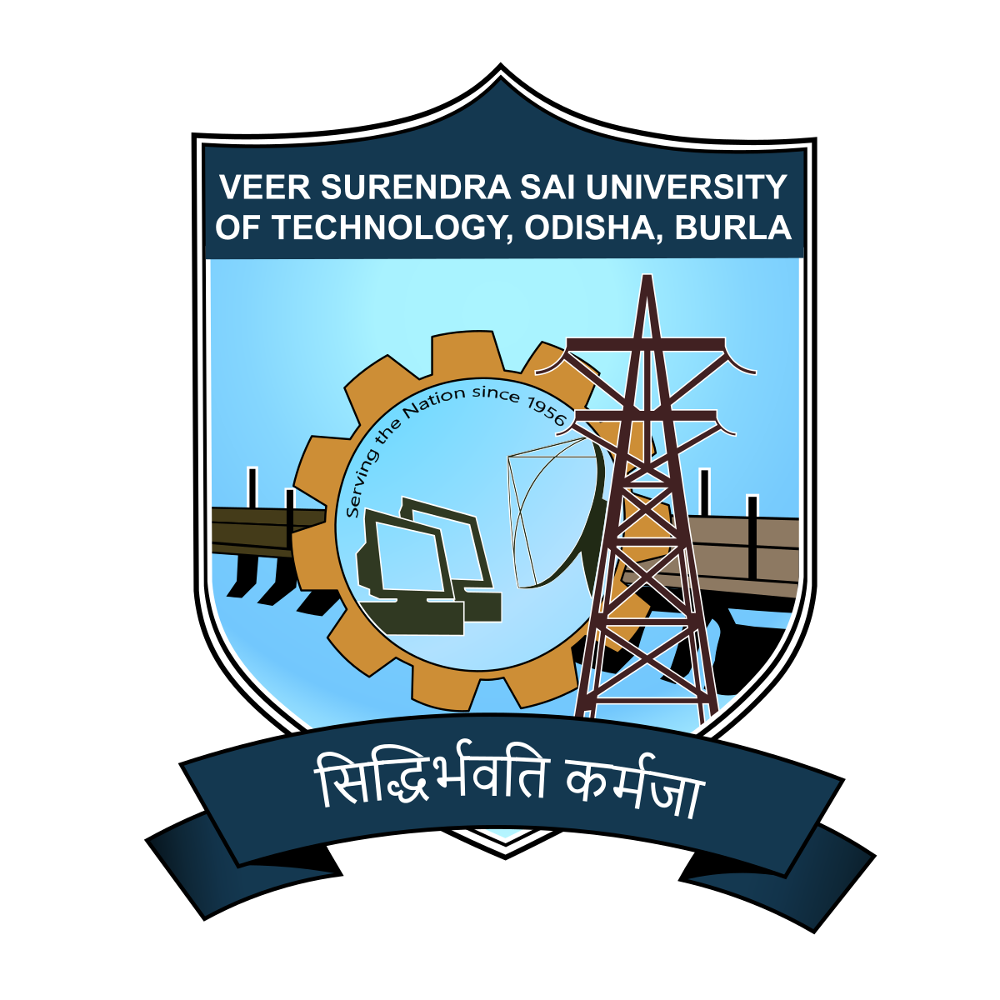
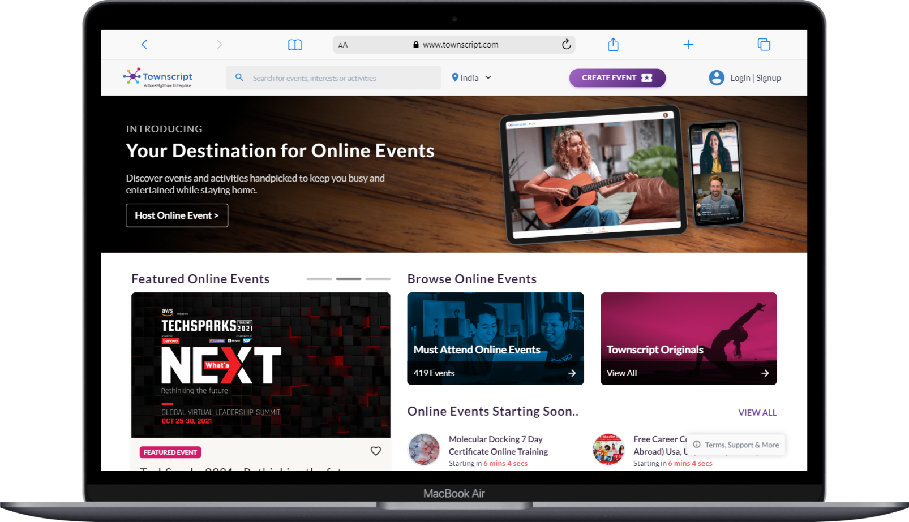

<div align="center">
  
  <h1>VSSUT Events - College Event Management System</h1>
</div>


<div align="center">


</div> <br/>


Initiated with the incentive to provide a common rostrum to host all college events, College Event Management (CEM) System is basically a platform where people can host their events and promote them for the students within the institute. One has to just create his/her account in CEM, then login to host his/her event and manage it as per his/her requirements. The entire process will save lot of time along with providing a better reach to the participants.

This repository is concerned with the frontend part of the project. CEM frontend provides an adaptive user interface with navigating menus and sliders, along with eye-catching graphics that brings better versatility to the user.

For those interested in working on the backend part of the project, do checkout the [backend repository](https://github.com/Developer-Student-Clubs-VSSUT-Burla/CEM-backend).


## 💻 UI

<a href="https://www.townscript.com/in/online"></a> <br/> <br/>

Inspired by Townscript's UI, we aim to have similar  layout for the components. New UI section will be added but as a whole the basic schema would stay the same.


## ⚙ Tech Stack Used

|Client |Server |Database |
|-------|-------|---------|
|[React](https://reactjs.org/)  |[Node](https://nodejs.org/en/) |[mongoDB](https://www.mongodb.com/) |
|[MaterialUI](https://mui.com/) |[Express](https://expressjs.com/) |
|[Hooks](https://reactjs.org/docs/hooks-reference.html) |

## 📡 Hosting

The project is hosted on [firebase](https://firebase.google.com/) for now. You can check the live website [here](https://vssut-event.web.app/). In future it will be deployed using [AWS](https://aws.amazon.com/) once the basic layout gets ready.

## 🛠 Installation & Set Up

Clone the project

```bash
  git clone https://github.com/Developer-Student-Clubs-VSSUT-Burla/CEM-frontend
```

Go to the project directory

```bash
  cd CEM-frontend
```

Install dependencies

```bash
  npm install
```

Start the development server

```bash
  npm run dev
```
## 🎨 Color Reference

| Color             |Color Name | Hex Code                                                               |
| ----------------- |------------ | ------------------------------------------------------------------ |
| Primary Color |Maastricht Blue |  `#0a192f` |
| Secondary Color |Cultured White |  `#f8f8f8` |
| Color 1 |Persian Green |  `#00b48a` |
| Color 2 | Caribbean Green | `#00d1a0` |


## 🖊 How to Contribute

Contributions are always welcome!

See **[contribution.md](./contribution.md)** for ways to get started.

**NOTE:** Please adhere to this project's [code of conduct](https://github.com/Developer-Student-Clubs-VSSUT-Burla/CEM-frontend/blob/main/contribution.md#code-of-conduct).


## ✨ Features

- Create and Manage Event
- Email Integration
- Fully Responsive
- calendar Scheduling
- Display Events from various colleges

## 📢 Acknowledgements
The project has been inspired by various event management sites. Few of them are listed below
 - [Townscript](https://www.townscript.com/in/online)
 - [EventBrite](https://www.eventbrite.com/)


## ⚒ Support, Suggestion, Updates

Join our Discord server to get regular updates, quick support and better guidance.  [Join Now](https://discord.gg/whFTXghqdV)

## 📜 License


<!-- Security scan triggered at 2025-09-02 01:23:58 -->

<!-- Security scan triggered at 2025-09-09 05:31:01 -->

<!-- Security scan triggered at 2025-09-28 15:33:55 -->